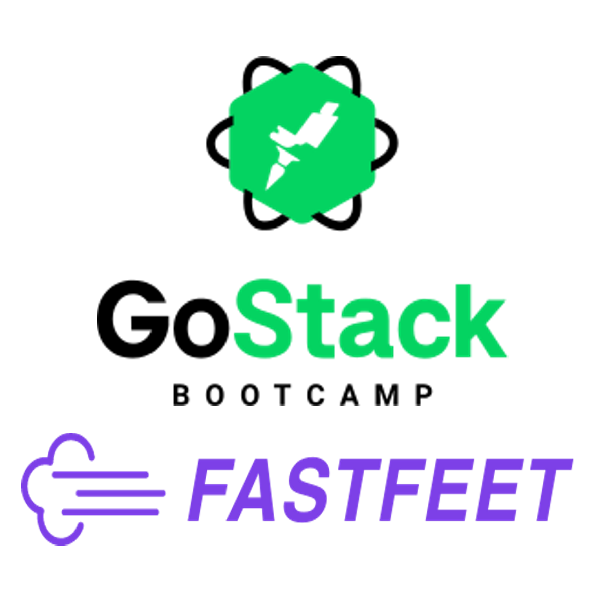

<h1 align="center">
    
</h1>

<h3 align="center">
  FastFeet - FrontEnd
</h3>
<p align="center">
  A ReactJS application for an administrator of a imaginary shoe delivery company
</p>

<p align="center">
  
  
   

  

</p>


:rocket: The Challenge
------------------
This challenge was proposed at a [**Rocketseat**](https://rocketseat.com.br/) GoSack bootcamp! The main objective is creating a 
front-end application for a imaginary delivery company. The back-end NodeJS server can be seen [here](https://github.com/lucascassilha/node-fastfeet)

The challenge GitHub page can be seen [here](https://github.com/Rocketseat/bootcamp-gostack-desafio-09#desafio-09-front-end-do-meetapp)
(Brazilian Portuguese)

#### Changes and Implementations!
In this project a few things were added that weren't in the instructions:

- Inform when the delivery doesn't have a provider!
- Inform when the delivery that has a problem has already been deleted!
- Created a pagination for each website field!
- Limited the page size (10)
- Create a postal code input mask!

:pencil2: The project
----------------------

<h3 align="center">
    
</h3>

<h3 align="center">
    
</h3>

<h3 align="center">
    
</h3>

<h3 align="center">
    
</h3>

<h3 align="center">
    
</h3>

<h3 align="center">
    
</h3>


<h3 align="center">
    
</h3>

<h3 align="center">
    
</h3>

<h3 align="center">
    
</h3>


:wrench: Technologies used
----------------------
In this project the following technologies and libraries were used:

- [**ReactJS**](https://reactjs.org)
- [**Redux**](https://redux.js.org/basics/usage-with-react/)
- [**Redux Saga**](https://redux-saga.js.org/)
- [**Redux Persist**](https://github.com/rt2zz/redux-persist)
- [**Styled Components**](https://styled-components.com/)
- [**React Router Dom**](https://reacttraining.com/react-router/web/guides/quick-start)
- [**React Icons**](https://react-icons.netlify.com/#/)
- [**Axios**](https://github.com/axios/axios)
- [**Yup**](https://github.com/jquense/yup)
- [**date-fns**](https://date-fns.org/docs/Getting-Started)
- [**History**](https://github.com/ReactTraining/history/blob/master/docs/GettingStarted.md)
- [**React Toastify**](https://github.com/fkhadra/react-toastify)
- [**Prop Types**](https://www.npmjs.com/package/prop-types)
- [**Immer**](https://github.com/immerjs/immer)
- [**Reactotron**](https://github.com/infinitered/reactotron)
- [**ESlint**](https://eslint.org/)
- [**Prettier**](https://prettier.io/)

## :information_source: How to use this project
To clone and run this application, you'll need Yarn. Input theese lines in your command line:

```bash
# Clone this repository
$ git clone https://github.com/lucascassilha/react-fastfeet

# Go into the repository
$ cd react-fastfeet

# Install dependencies
$ yarn

# Run the app
$ yarn start
```

After that you can access the page in yout localhost:3000

## :scroll: License

This project is under the [MIT license](LICENSE)

:speech_balloon: Reach me
----------

[*In case you want to reach me*](https://www.linkedin.com/in/lcassilha/)


Thank you for taking a look at my project! Made with ♥
